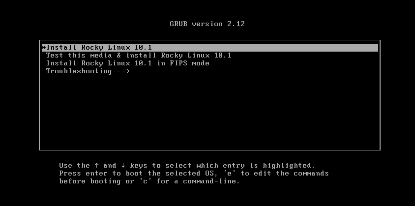
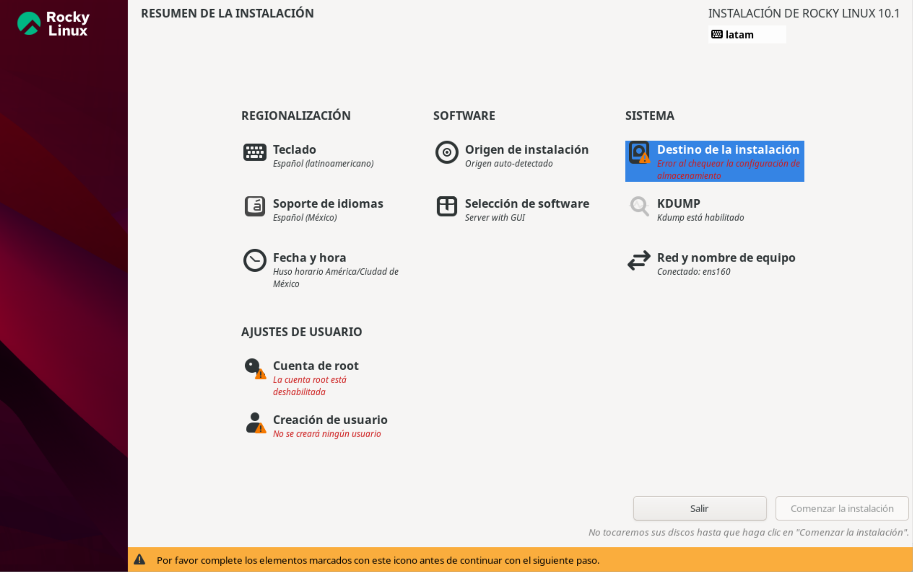
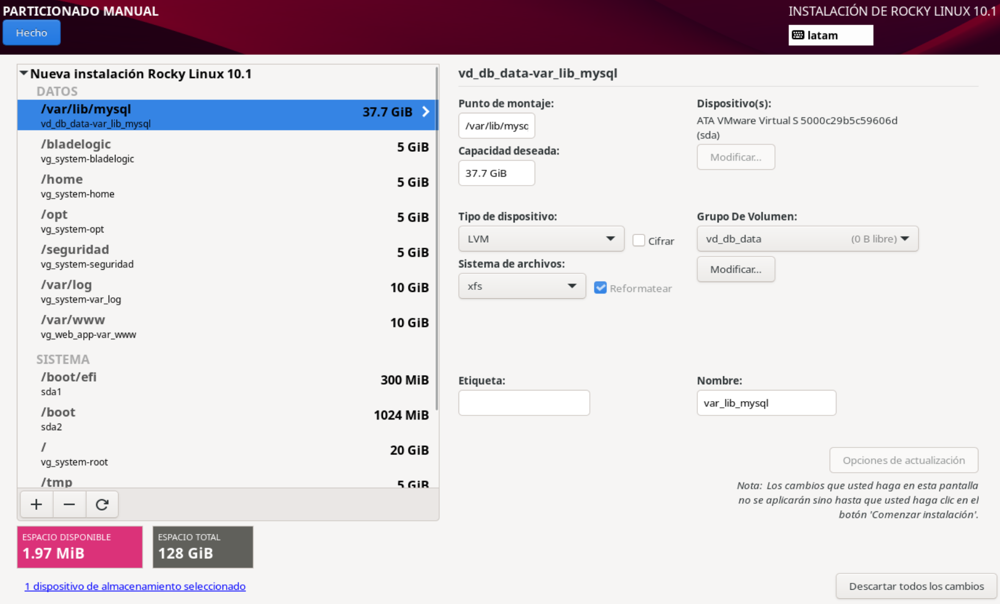
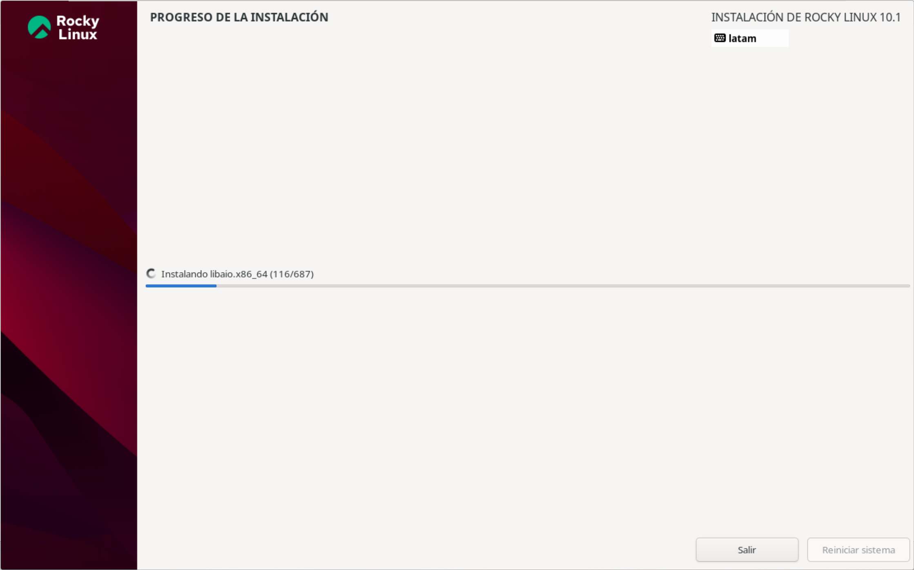
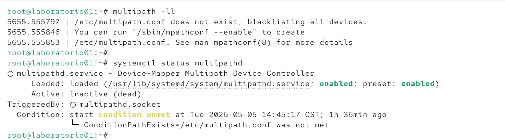

# 🧰 Runbook: 
# Instalación de Rocky Linux 10.1 (Producción DB + Web)

---

## 📌 Objetivo

Instalar Rocky Linux 10.1 con un esquema de particionado profesional usando LVM, optimizado para servidor de base de datos y aplicaciones web.

---

## 🧱 Requisitos

- ISO de Rocky Linux 10.1 (o semilla preconfigurada por tu empresa)
- Acceso a consola (VM, iLO, DRAC, etc.)
- Disco(s) disponibles (asignados por el equipo de storage, 1 disco de 128GiB para BOOT)
- Direccion IP, Mascara y subred.

---

## 🚀 Inicio del Procedimiento

### 1. Boot desde ISO

 Selecciona: `Install Rocky Linux 10.1`





&nbsp;

---
### 2. Selección de idioma

- Español o Inglés (según estándar de tu empresa)
&nbsp;

---
&nbsp;

### 3. Configuración de Red y Nombre del equipo

- Configurar hostname y habilitar red

!!! info "Tip de Red"
    Recuerda activar el interruptor de la tarjeta de red en el instalador, de lo contrario la interfaz quedará `disconnected` tras el primer arranque.
&nbsp;
 
---
&nbsp;

### 4. Sistema - Destino de la Instalación

Seleccionar:
- `Configuracion de almacenamiento` → `Personalizada`→ `Hecho`


### 🔹 Crear particiones estándar

| Punto de montaje | Tipo de partición        | Sistema de archivos | Tamaño recomendado   | Notas |
|------------------|--------------------------|---------------------|----------------------|------|
| `/boot`          | Standard Partition       | xfs                | 1 GiB                 | Fuera de LVM |
| `/boot/efi`      | Standard Partition       | EFI System Partition (vfat) | 300–600 MiB | Requerido para UEFI |


### 🔹 Crear particiones LVM

| Punto de montaje   | FS  | Tamaño sugerido |  VG  |
|--------------------|-----|-----------------|------|
| `/`               | xfs | 20–30 GiB |	 vg_system  |
| `/var`            | xfs | 20–40 GiB |  vg_system  |
| `/var/log`        | xfs | 10–20 GiB |  vg_system  |
| `/var/www`        | xfs | 10–20 GiB |  vg_web_app |
| `/var/lib/mysql`  | xfs | 50–70% del disco |  vg_db_data |
| `/tmp`            | xfs | 5–10 GiB |   vg_system  |
| `/home`           | xfs | 5–10 GiB |   vg_system  |
| `/opt`            | xfs | 5–15 GiB |   vg_system  |
| `/bladelogic`     | xfs | 10–50 GiB |  vg_system  |
| `/seguridad`      | xfs | 10–50 GiB |  vg_system  |
| `swap`            | swap| 4–16 GiB |   vg_system  |


Una vez terminado el particionado selecciona:
 `Hecho`→ `Hecho` 



---

###  5. Selección de software

  - `Server(recomendado)`


---

###  6. Seguridad

- Establecer contraseña de root
- Crear usuario administrador (opcional), marcar `membresia al grupo wheel`.

---

###  7. Iniciar instalación

- Click en `Comenzar la installation` y esperar a que finalice.




---

###  8. Reinicio

- Retirar ISO
- Reiniciar sistema

---

&nbsp;
### 9. Multipath

Por defecto, **Rocky Linux** no crea el archivo `/etc/multipath.conf` durante una instalación estándar. 

Si el servicio intenta arrancar sin este archivo, verás un error indicando que se ignorarán todos los dispositivos (*blacklisting all devices*).



!!! tip "Solución rápida"
    Si necesitas usar multipath, debes inicializarlo manualmente para generar los valores predeterminados de fábrica:
    ```bash title="Inicializar Multipath"
    sudo mpathconf --enable --with_multipathd y
    ```
    *Este comando crea `/etc/multipath.conf`, habilita el servicio y lo inicia de forma automática.*


&nbsp;
Una vez ejecutado, verifica que el demonio esté activo y los dispositivos sean visibles:

```bash title="Comprobación"
# Listar topología de multipath
sudo multipath -ll

# Verificar estado del servicio
sudo systemctl status multipathd
```

Una vez que el servicio muestra el estado **active (running)**, la configuración ha finalizado correctamente.


&nbsp;
&nbsp;
&nbsp;

---
###  10. Actualizacion Inicial del Sistema

```bash title="bash"
   sudo dnf update -y
``` 


&nbsp;
&nbsp;
&nbsp;


---

## 🔍 Validaciones Post-instalación

---

&nbsp;
```bash title="Post-check del Sistema"
hostnamectl                         # Información del sistema
uname -r                            # Kernel activo
cat /etc/os-release                 # Versión del OS

lsblk                               # Discos detectados
df -Th                              # Uso de filesystem

pvs                                 # Physical Volumes (LVM)
vgs                                 # Volume Groups
lvs                                 # Logical Volumes

multipath -ll                       # LUNs SAN (si aplica)

nmcli device status                 # Interfaces de red
nmcli connection show               # Conexiones
ip address                          # IPs asignadas

ping -c 2 8.8.8.8                   # Prueba conectividad IP
ping -c 2 google.com                # Prueba DNS

systemctl status NetworkManager     # Servicio de red
systemctl status sshd               # Servicio SSH

systemctl list-units --failed       # Servicios con error
journalctl -p 3 -xb                 # Errores críticos

whoami                              # Usuario actual
id                                  # UID/GID

df -Th /boot                        # Espacio en boot
timedatectl                         # Hora del sistema 

```

<small>*Nota: Es necesario contar con privilegios de administrador (sudo) para la ejecución de todos los comandos anteriores.*</small>

---


## ✅ Fin del Procedimiento


## 📚 Referencias


