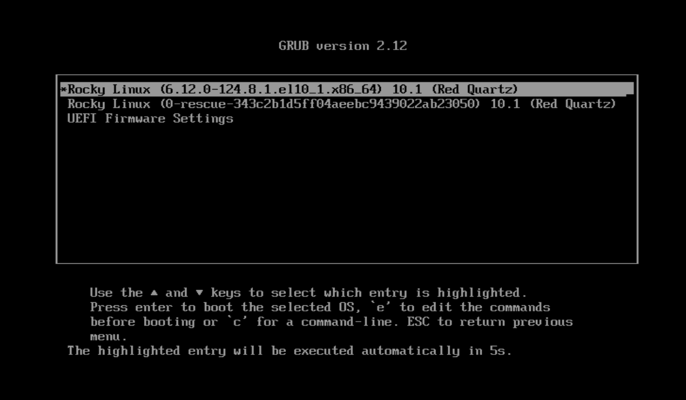
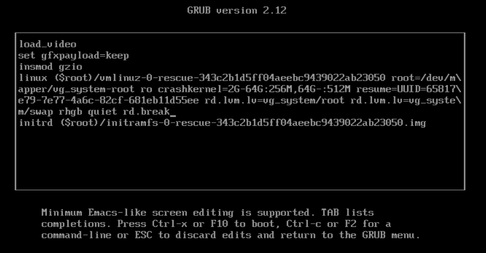

# 🧰 Runbook:
# Recuperación de contraseña root en Rocky Linux

&nbsp; 
# 📌 Objetivo
Restablecer la contraseña del usuario `root` en un servidor Rocky Linux utilizando el modo de rescate desde GRUB.

---

&nbsp;
# Método 1 — Reset desde GRUB (Recomendado)

## 🧱 Requisitos
- Acceso a consola física, IPMI, iLO, VMware Console o similar.
- Solicitar Baja de servicios y ventana controlada ya que se requiere reiniciar el servidor.

---


&nbsp;
## 🚀 Inicio del Procedimiento


## Paso 1 — Reiniciar el servidor

Reinicia el sistema:

```bash
reboot
```

o desde consola remota/IPMI.

---


&nbsp;
## Paso 2 — Entrar al menú GRUB

Durante el arranque:

- Presiona `e` sobre la entrada de Rocky Linux.



---


&nbsp;
## Paso 3 — Modificar parámetros del kernel

Ubicar la línea que inicia con `linux` o `linuxefi` y agregar al final:

```text
rd.break
```

Ejemplo:



---


&nbsp;
## Paso 4 — Arrancar en modo emergencia

Presiona:

```text
Ctrl + X
```

o:

```text
F10
```

---


&nbsp;
## Paso 5 — Remontar filesystem en modo escritura

Cuando aparezca el shell de emergencia:

```bash
mount -o remount,rw /sysroot
```

---


&nbsp;
## Paso 6 — Cambiar raíz al sistema real

```bash
chroot /sysroot
```

---


&nbsp;
## Paso 7 — Cambiar contraseña root

```bash
passwd root
```

Ingresa la nueva contraseña.

Ejemplo:

```text
New password:
Retype new password:
passwd: all authentication tokens updated successfully.
```

---


&nbsp;
## Paso 8 — Relabel SELinux

IMPORTANTE en Rocky Linux / RHEL:

```bash
touch /.autorelabel
```

---


&nbsp;
## Paso 9 — Salir del entorno chroot

```bash
exit
```


&nbsp;
## Paso 10 — Reiniciar servidor

```bash
reboot
```

El primer arranque puede tardar varios minutos por el relabel de SELinux.

---


&nbsp;
## 🔍 Validaciones Post-instalación

Inicia sesión con:

```bash
root
```

y la nueva contraseña.

---


&nbsp;

## ✅ Fin del Procedimiento


## 📚 Referencias


